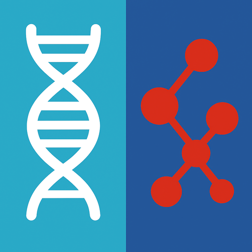

#  GA4GH Phenoboard

Curation of individuals with Human Phenotype Ontology and GA4GH Phenopacket Schema.
See the [documention](https://p2gx.github.io/phenoboard/) for a tutorial. Go to the 
[Releases](https://p2gx.github.io/phenoboard/releases) page for installation files for Macintosh, Windows, and Debian/Ubuntu linux.

