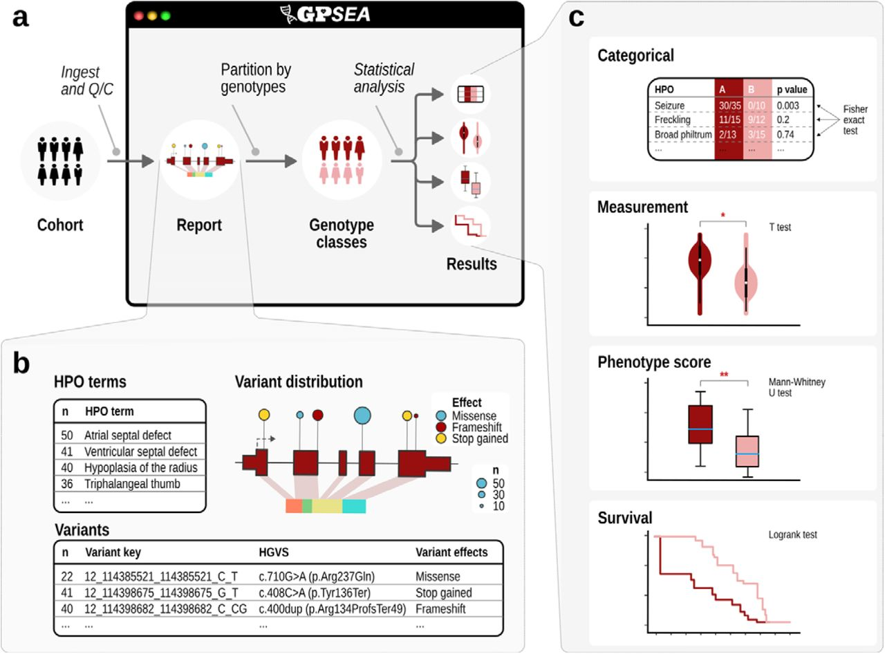

## GPSEA (Genotype-Phenotype Statistical Evaluation of Associations)

There are a huge number of clinical manifestations of human disease, and even individuals with the same clinical diagnosis may present with different combinations of phenotypic abnormalities, ages of onset of these abnormalities, and degrees of clinical severity. A key question for genomic precision medicine is how specific genetic variants influence clinical phenotype. The correlation between genotype (the type of variant or variants present at a given location) and phenotype (presence or absence of medically relevant observable traits) is defined as an above-chance probability of an association between the two, an association termed genotype-phenotype correlation (GPC). GPSEA leverages case-level phenopackets, characterizing an individual person or biosample and linking the individual to detailed phenotypic descriptions, genetic information, diagnoses, and treatments. GPSEA automates the process of visualizing and performing GPC analysis ([GA4GH Phenopacket-Driven Characterization of Genotype-Phenotype Correlations in Mendelian Disorders](https://pubmed.ncbi.nlm.nih.gov/40093222/)).

<figure>
  
  <figcaption>
    <strong>Schematic overview of GPSEA workflow.</strong>. 
a) Overview. GPSEA is a Python package designed to work well in Jupyter notebooks. GPSEA takes a collection of GA4GH phenopackets as input, performs quality assessment and visualizes the salient characteristics of the cohort; genotype classes are defined (Figure 2); and one of four classes of statistical test is performed for each hypothesis the user decides to test. b) Visualize data and formulate hypotheses. GPSEA displays tables with the distribution of phenotypic abnormalities, disease diagnoses, variants, and other information, and presents a cartoon with the distribution of variants across the protein. This information intends to help users formulate hypotheses about genotype-phenotype correlations (GPCs). c) Statistical testing. GPSEA offers four main ways of testing phenotypes.
  </figcaption>
</figure>