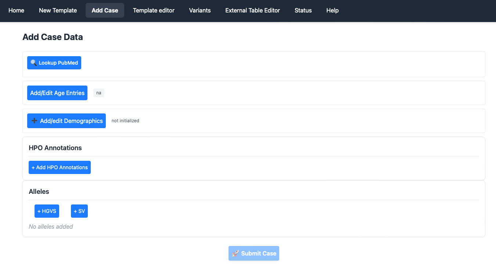
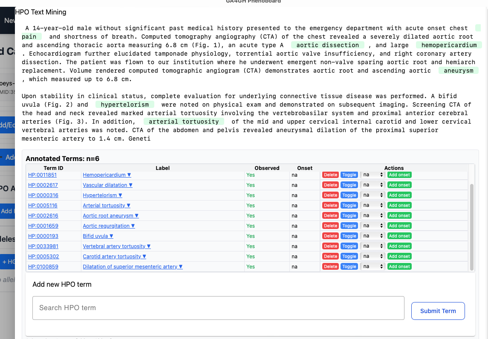
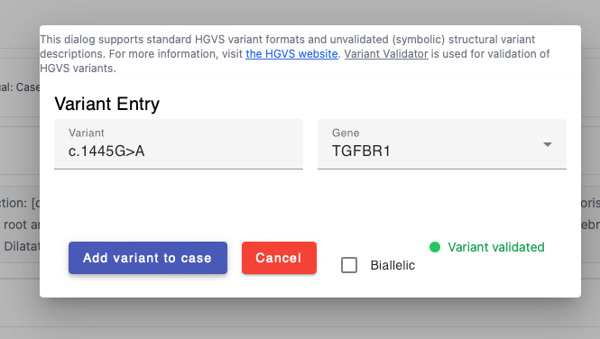
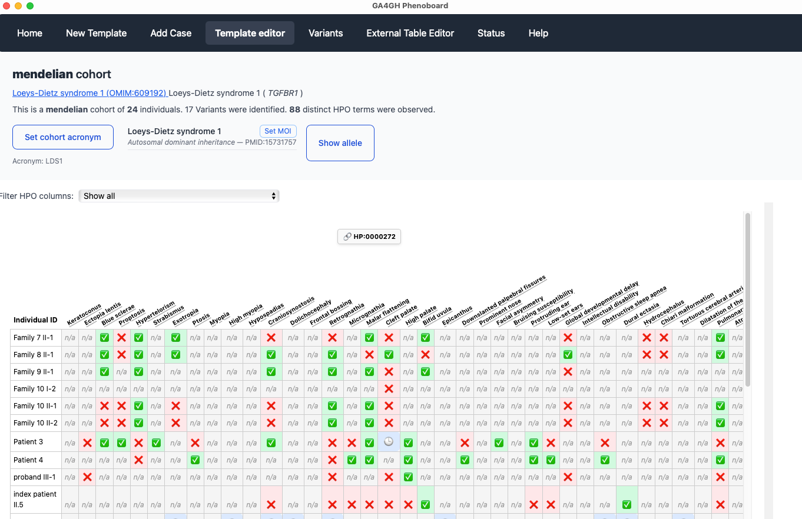

# Case reports

Phenoboard allows individual case reports to be curated using text mining. This functionality is useful for publications with narrative descriptions of a case. In this example, we will curate an individual with [Loeys-Dietz syndrome type 1](https://omim.org/entry/609192) from [PMID: 35003478](https://pubmed.ncbi.nlm.nih.gov/35003478/). First, make sure that information about a cohort has been loaded by either using the [new cohort](newcohort.md) page or by loading an existing cohort JSON file. Then go to the Add Case page.

<figure>
  
  <figcaption>
    <strong>Add case</strong>. Users should enter information in each of the sections on this page, after which the submit case button will be activated, allowing the case information to be added to the cohort.
  </figcaption>
</figure>

## Lookup PubMed
Phenoboard is currently setup to curate published literature with a PubMed identifier (contact us if you would like to use the app for in house cohorts). The user will first need to enter a PMID, either as ``PMID: 35003478``or with just the number (``35003478``). The app will reach out to PubMed and retrieve the title, which is also stored. The app will warn users if it is attempted to enter a previously used PMID (perhaps because the same article is being mistakenly entered a second time). If you are entering multiple individuals from the same article, the warning can be ignored.

## Add/Edit Age entries.
Enter the age entries needed to curate the case. See [GA4GH Phenopackets: A Practical Introduction](https://pubmed.ncbi.nlm.nih.gov/36910590/) and the [Phenopacket Schema documentation](https://phenopacket-schema.readthedocs.io/en/latest/) for information about how to represent ages. In brief, one case use one of three options:
- [HPO Onset terms](https://hpo.jax.org/browse/term/HP:0003674), e.g., "Congenital onset"
- [ISO 8601 Periods](https://en.wikipedia.org/wiki/ISO_8601#Durations), e.g., P3Y4M2D for 3 years, 4 months, and 2 days
- [Gestational age](https://en.wikipedia.org/wiki/Gestational_age), which we represent, for instance, as G32w4d for 32 weeks and 4 days.

## Add/Edit Demographics
Enter the identifier of the patient as used within the publication (it must be unique within the publication is multiple individuals are curated), as well as the age of onset, age when the individual was last medically examined, the sex, deceased status, and if desired an optional comment. Only the individual identifier is required (in our example, the onset and the last encounter age are both 14 years, P14Y, and the affected individual is a boy who is not deceased; we entered the individual ID as ``Case report``because that is the title used for the clinical description. It would also be acceptable to use ``14 year old male``because the individual is described in this way by the authors).

##  Add HPO annotations
This widget performs text mining on text that is pasted into the window.

<figure>
  
  <figcaption>
    <strong>Text mining</strong>. Users should paste clinical descriptions into the window and perform text mining. They should read the text and correct the results as necessary. The toggle button switches "observed" to "excluded" status and vice versa. If possible, specify the onset of each feature. By clicking on the terms, it is possible to replace a term by a more specific child or less specific parent, if the text mining result needs to be modified. Finally, additional terms can be added using the autocomplete window.
  </figcaption>
</figure>

When you are finished adjusting the text mining results, click "Finish".

## Alleles
You can add HGVS (small variants) or SV (structural variants) using the provided widgets. Make sure the HGVS notation is based on the transcript of reference. If a variant is noted in the publication to be homozygous, click the "biallelic" checkbox.

<figure>
  
  <figcaption>
    <strong>Add variant/alleles</strong>. Enter a valid HGVS string or symbol representation of a structural variant (e.g., DEL exon 5). For structural variants, enter the category (e.g., deletion, duplication, inversion, etc.).
  </figcaption>
</figure>

## Submit case
When all of the above information has been added, the case can be added to the cohort with the ``Submit case`` button. You will be taken to the [cohort editor screen](cohort-editor.md).

<figure>
  
  <figcaption>
    <strong>Cohort editor</strong>. Functions are provided to edit individual cells. Users may choose to compare the annotations for the case they entered (which will be on the last line), with the annotations for other cases, and if there are important pieces of information that appear to be missing, they can go back to the curated publication and search for them. It is important to curate not only observed features but also explicitly excluded features.
  </figcaption>
</figure>
