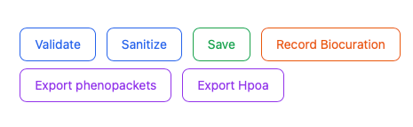

# Cohort editor

This screen allows users to visualize and edit the entire cohort.

<figure>
  
  <figcaption>
    <strong>Cohort editor</strong>. Functions are provided to edit individual cells. Users may choose to compare the annotations for the case they entered (which will be on the last line), with the annotations for other cases, and if there are important pieces of information that appear to be missing, they can go back to the curated publication and search for them. It is important to curate not only observed features but also explicitly excluded features.
  </figcaption>
</figure>

## Saving cohort

To save a cohort, click on the validate button to check for errors. The ``Sanitize``button can automatically correct some kinds of errors. If this does not work, the offending table cell(s) will need to be revised. The ``Save``button saves the JSON cohort file. The ``Export Phenopackets``button exports each row of the table as one phenopacket. You should add your ORCID id to the files with the ``Record biocuration`` button (this needs to be done before saving). The ``Export HPOA`` button exports HPO annotations in aggregated tabular format.

<figure>
  
  <figcaption>
    <strong>Saving work</strong>. 
  </figcaption>
</figure>