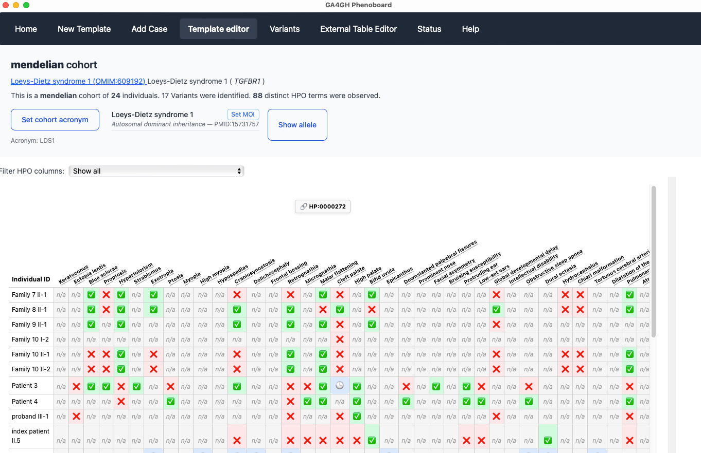
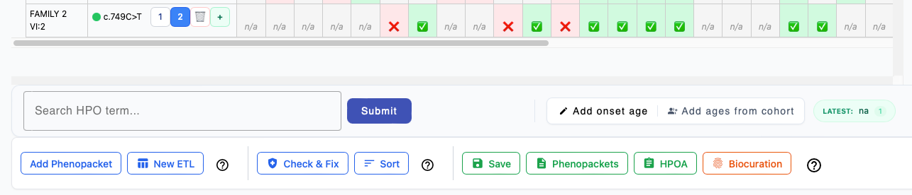

# Cohort editor

This screen allows users to visualize and edit the entire cohort.

<figure>
  
  <figcaption>
    <strong>Cohort editor</strong>. Functions are provided to edit individual cells. Users may choose to compare the annotations for the case they entered (which will be on the last line), with the annotations for other cases, and if there are important pieces of information that appear to be missing, they can go back to the curated publication and search for them. It is important to curate not only observed features but also explicitly excluded features.
  </figcaption>
</figure>

# Final Review & Submission
After you have entered all of the data for each individual, phenoboard offers several functions to validate the curation data and export to file.

<figure>
  
  <figcaption>
    <strong>Reviewing curation and export to file</strong>. 
  </figcaption>
</figure>

## 1. Add Phenopacket
Switch to the <i>New Template</i> tab to enter an additional case report to the current cohort.

## 2. New ETL
Switch to the <i>External Table Editor</i> tab to import an additional table of data about individuals to the currrent cohort.

## 3. Check and Fix
Validate the current cohort (it is recommended to perform this step before saving the cohort). Some operations can be performed automatically; for instance, if the only warning is that redundant annotations were found, then phenoboard can correct them automatically.
For instance, if an individual is annotated with [Perimembranous ventricular septal defect 
HP:0011682](https://hpo.jax.org/browse/term/HP:0011682), then according to subsumption logic of ontologies, the individual is implicitly annotated to all of the ancestors of the term. Intuitively, it is easy to see that if an individual has [Perimembranous ventricular septal defect 
HP:0011682](https://hpo.jax.org/browse/term/HP:0011682), then the individual can also be said to have [Ventricular septal defect 
HP:0001629](https://hpo.jax.org/browse/term/HP:0001629), and it is redundant to annotate the latter term. Phenoboard will automatically remove such redundant annotations if the user confirms the message that appears after clicking <i>Check & Fix</i>.

## 4. Sort
If desired, the rows of the cohort can be sorted according to PMID (earliest to latest) using this button.

## 5. Saving cohort

To save a cohort, click on the validate button to check for errors. The ``Sanitize`` button can automatically correct some kinds of errors. If this does not work, the offending table cell(s) will need to be revised. 

## 6. Phenopackets
The ``Phenopackets`` button exports each row of the table as one phenopacket. 

## 7.  HPOA
The ``HPOA`` button exports HPO annotations in aggregated tabular format.

## 8. Biocuration
This button adds your ORCID identifier to the cohort export file.

