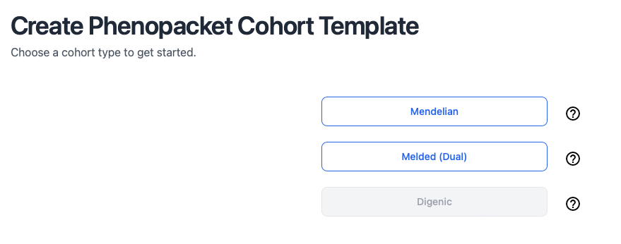
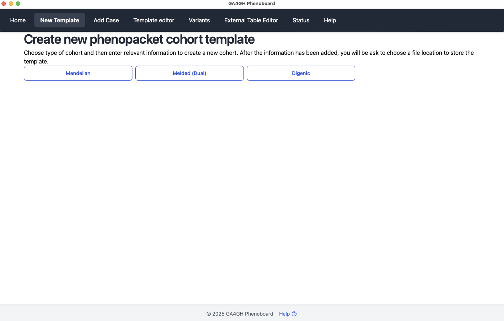

# New cohort

Phenoboard creates cohort files (JSON files) that represent one or more individuals diagnosed with a disease. There are three support disease categories:

- Mendelian
- Melded phenotypes
- Digenic disease

<figure>
  
  <figcaption>
    <strong>Choose one of three cohort types to curate</strong>.
  </figcaption>
</figure>

## Choose cohort type
Once we have created a new cohort, we can curate either a phenopacket (one individual, e.g., from a published case report) or a cohort (group or individuals, e.g., from a published cohort report with a table of clinical findings with one row or column per individual).

<figure>
  
  <figcaption>
    <strong>Start curating either a phenopacket or a cohort (e.g., table from the supplemental material of a publication)</strong>.
  </figcaption>
</figure>