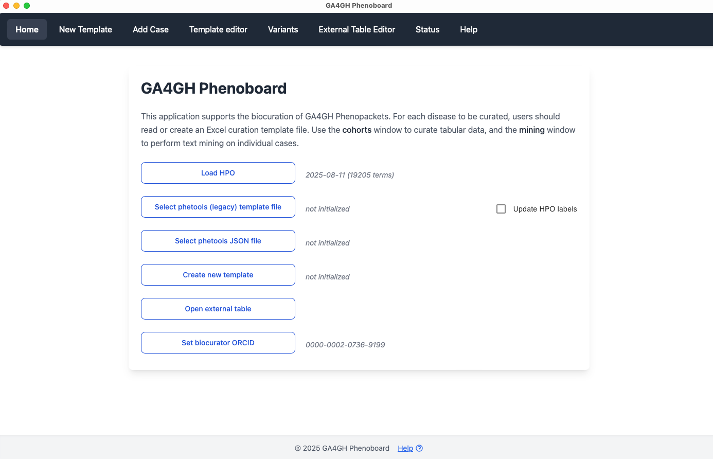

# Start page 

Phenoboard offers several ways of curating clinical data. The start page of the app shows these options.

<figure>
  
  <figcaption>
    <strong>Phenoboard start page</strong>.
  </figcaption>
</figure>

## Load the HPO
Before curation, the user needs to load the ``hp.json`` file. We recommend always using the latest version, which can be found in the [Download](https://hpo.jax.org/data/ontology) section of the HPO website. Do *not* use the hp.obo or hp.owl files. Once you have loaded
the hp.json file, the path to the file is stored in the phenoboard settings directory, and the ontology will be loaded automatically upon program start. We recommend always using the
latest version (there are about 10 HPO releases annually; check for new releases as required).

## Select phetools (legacy) template file
This option is only of use to the HPO maintainers. The first version of [Phenopacket Store](https://pubmed.ncbi.nlm.nih.gov/39394689/) was developed using a standardized Excel template, which we are currently updating to use the Phenoboard JSON format. Note that the phenopackets generated from both sources are identical. This option will disappear once the HPO maintainers have finished the migration to the new format.

## Open an existing cohort
Phetools stores all information about a cohort in a single JSON file. Phetools can create a users files (such as summary tables or a collection of phenopackets from this file). In general, when working on a cohort over a period of time, users should save results in the cohort file, and when they are finished, create the required downstream files for analysis (usually phenopackets).

## Create new cohort
Phetools can manage cohorts for Mendelian and blended conditions (See [Cohort editor](./cohort-editor.md) for details).

## ORCID
Before using Phenoboard for the first time, the user needs to enter an [ORCID](https://orcid.org/) research indentifier. Enter just the number (e.g., enter `0000-0002-0736-9199` and not `https://orcid.org/0000-0002-0736-9199`). Phenoboard stores the ORCID in its settings directory (which is automatically created as a hidden directory in the user's home directory upon the first use of the app). From this point on, the ORCID will be automatically loaded upon program start.
