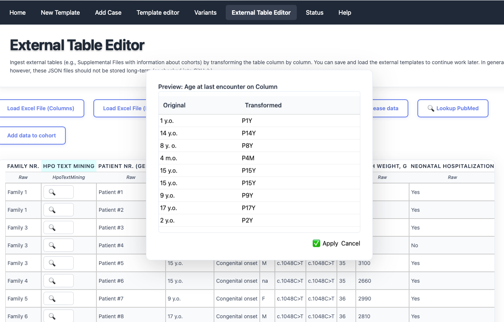

# Table editor

Some articles present information about groups (cohorts) of individuals in tables that are either placed within the main article or are provided as a supplemental table. There is no accepted format for such tables, any we have observed a great deal of heterogeneity. However, it can save a lot of time to curate an entire table at once. Phenoboard provides the External Table Editor functionality for these cases. Users need to save the table they would like to transform as an Excel table, and then open it with the Load Excel buttons (one button each is provided for tables with row-based or column-based structure).  Note that some external Excel files strew information about a single entity over multiple rows or columns. In this case, users will need to manually edit the files to put all information about a given entity into one cell.

Then, each column is processed by right clicking on the column header or as needed on individual cells.

<figure>
  
  <figcaption>
    <strong>External table editor</strong>. Here, the user has right-clicked on the table header and is transforming the contents to Age entries.
  </figcaption>
</figure>

## Functionality

The functions of phenoboard can be explored by right-clicking on column headers or cells. 

## Saving

When all columns have been processed, the user can add all rows to the current cohort (which must be previously entered!).