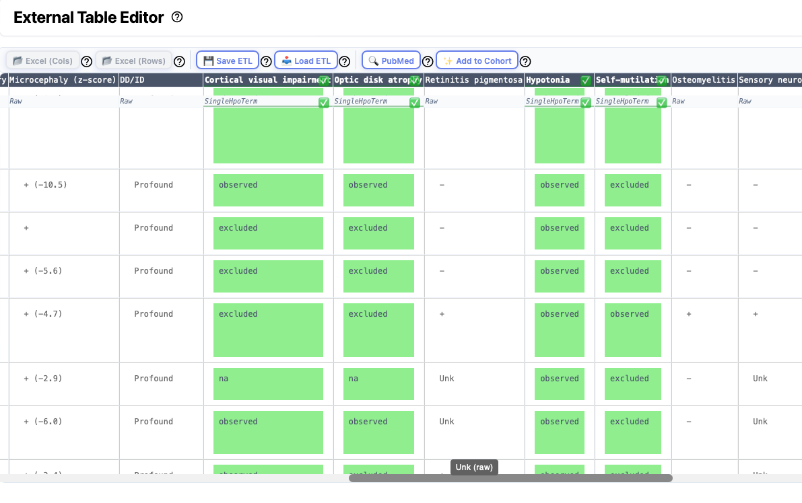
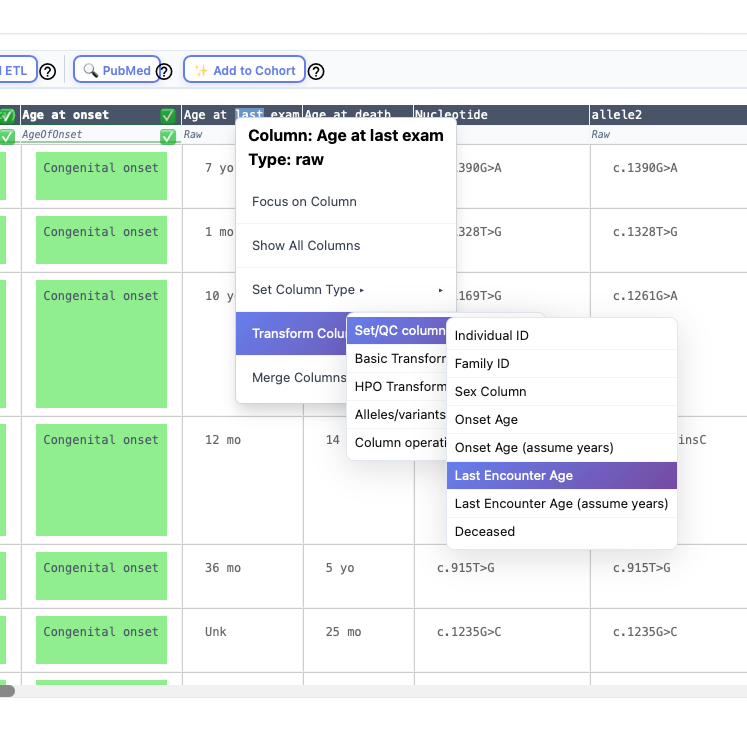

# Table editor

Some articles present information about groups (cohorts) of individuals in tables that are either placed within the main article or are provided as a supplemental table. There is no accepted format for such tables, any we have observed a great deal of heterogeneity. However, it can save a lot of time to curate an entire table at once. Phenoboard provides the External Table Editor functionality for these cases. Users need to save the table they would like to transform as an Excel table, and then open it with the Load Excel buttons (one button each is provided for tables with row-based or column-based structure).  Note that some external Excel files strew information about a single entity over multiple rows or columns. In this case, users will need to manually edit the files to put all information about a given entity into one cell.

Then, each column is processed by right clicking on the column header or as needed on individual cells.

<figure>
  
  <figcaption>
    <strong>External table editor</strong>. Users should work through the columns one by one. Successfully transformed columns are shown in green. The follow sections explain how to use the tool.
  </figcaption>
</figure>

## Excel import 
Clinical data about cohorts is often provided in tabular form in the medical genetics literature. Often, supplemental tables with clinical data about the cohort are provided as Excel files.  Use the *Excel (Cols)* button to import Excel files in which 
data for each individual is represented by a column. Use *Excel (Rows)* button to import Excel files in which 
data for each individual is represented by a row. 

> **Warning**  
> Some excel files encountered in the literature can be difficult to parse. For instance, sometimes there are formatting errors such that the contents of one cell "spills over" into the next row. Sometimes, information about two different items
is presented in the same cell (e.g., Age and Sex). Phenoboard provides functionality to merge and split cells that may help to 
deal with this, but it may be easier to manually edit the excel file in some cases.

The Excel import buttons are disactivated if there is no current cohort. Thus, if you are trying to create a cohort from scratch based on an Excel file, you first need to create the cohort data using the [New Cohort](newcohort.md) page.

## Saving and Loading ETL files

If you would like to save your work and come back later to finish, use the *Save ETL* button to save the file that contains the current state of the ETL file. Use the *Load ETL* button to load the file and resume work where you left off.

> **ETL**: Extract transform load
> ETL is a three-phase computing process where data is extracted from an input source, transformed (including cleaning), and loaded into an output data container. In our case, we are extracting data from the original Excel file, transforming it into HPO terms and other data required for the phenopacket, and loading the transformed data into the Cohort data structure that phenoboard uses to store data about cohorts of individuals (phenopackets).

## PMID

Assign the PubMed identifier of the article from which the cohort data was taken.

## Add to cohort

When you are finished transforming each column, the next step is to load the data into the current cohort. This is not
possible unless all columns have been transformed or marked as "Ignored" (except for the HPO Text Mining column, which is optional).

## Transforming columns
Phenoboard offers a number of different functions for transforming columns, each of which can be started from the context menu that appears upon right click. The following sections describe the major functionalities. Many of the dialogs also provide help that can be accessed by clicking on the **?** symbol.

### Demographic information
Each individual can be annotated with an individual identifier, sex, age of onset, age at last encounter, deceased status. Optionally, a column with a family identifier can be marked and merged with the individual identifier column. To do this, right click on the column header and navegate the context menu as shown below.

<figure>
  
  <figcaption>
    <strong>Importing age entries</strong>. 
  </figcaption>
</figure>

### Individual ID
This entry must be unique in the cohort. For instance, it would be an error to have two rows with the identifier "Individual A". 

### Sex column
This column is used to specify the biological sex of the individual. A variety of formats are transformed into the phenopacket standard entries:
- **M**: Male
- **F**: Female
- **O**: Other
- **U**: Unknown (or not recorded, not available)

### Age of onset/Age at last encounter
Enter the age at first manifestation of any clinical manifestation related to the disease (Onset) and the age at which the individual was last medically examined (last encounter). The ingest will try to transform the data in the column into a Gestational age, HPO term, or ISO 8601 string as appropriate. It is common to see that the age is provide in years (just the number without "y" or "years"). In this case, use the "Assume years" option to ingest the data.

### Deceased
The data in this column must be in the phenopacket format
- **yes**: deceased
- **no**: alive
- **na**: unknown/not available

Further information about these fields can be found in the [Phenopacket Schema documentation](https://phenopacket-schema.readthedocs.io/en/latest/).