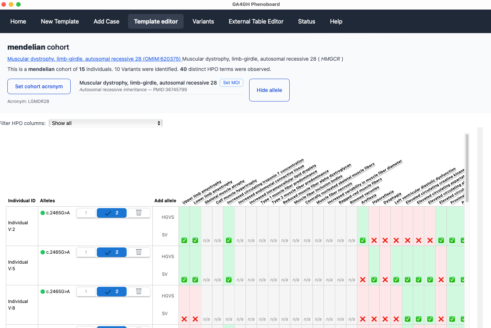

# Introduction

[GA4GH](https://www.ga4gh.org/) Phenoboard is a [tauri](https://v2.tauri.app/) app designed 
to help curate cohorts of individuals with rare genetic disease using the
[GA4GH Phenopacket Schema](https://phenopacket-schema.readthedocs.io/en/latest/).

## Download
Installers for Mac, Windows, and Linux are available from the [Releases](https://github.com/P2GX/phenoboard/releases) page of the GitHub [repository](https://github.com/P2GX).

## Background
Phenoboard is designed to curate cohorts of individuals with heritable diseases for the HPO project.

- [Phenopacket Schema](background/phenopackets.md)
- [HPO](background/hpo.md)

## The Application
Phenoboard is a tauri application that can be installed on Mac, Windows, and Debian linux systems. Most users will want to download prebuilt installers from the [Releases page](https://github.com/P2GX/phenoboard/releases) of the projects [GitHub repository](https://github.com/P2GX/phenoboard). 

Users can curate individuals with a certain disease, represented using an [OMIM](https://omim.org) identifier. One or many individuals can be curated.  The [help](help/overview.md) section provides tutorials for the major functionalities of the app.

- [Installation](help/installation.md)
- [Enter data for new cohort](help/newcohort.md)
- [Curate one individual](help/)

<figure>
  
  <figcaption>
    <strong>GA4GH Phenoboard</strong>. Phenoboard is an application for biocuration of case and cohort reports in genetic medicine.
  </figcaption>
</figure>
