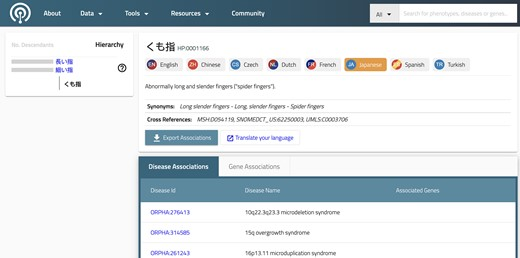

# Introduction

[GA4GH](https://www.ga4gh.org/) Phenoboard is a [tauri](https://v2.tauri.app/) app designed 
to help curate cohorts of individuals with rare genetic disease using the
[GA4GH Phenopacket Schema](https://phenopacket-schema.readthedocs.io/en/latest/).

## GA4GH Phenopackets

The Global Alliance for Genomics and Health ([GA4GH](https://www.ga4gh.org/)) is developing a suite of coordinated standards for genomics for healthcare. The Phenopacket is a GA4GH standard for sharing disease and phenotype information that characterizes an individual person, linking that individual to detailed phenotypic descriptions, genetic information, diagnoses, and treatments.

<figure>
  
  <figcaption>
    <strong>Phenopacket Schema overview</strong>. The GA4GH Phenopacket Schema is a hierarchical structure that consists of two required fields, id and MetaData, as well as eight optional fields, Individual, Disease, Interpretation, Biosample, PhenotypicFeature, Measurement, MedicalAction, and files ([GA4GH Phenopackets: A Practical Introduction](https://pubmed.ncbi.nlm.nih.gov/36910590/))
  </figcaption>
</figure>

## Human Phenotype Ontology (HPO)
Ontologies are systematic representations of knowledge that can be used to capture medical phenotype data by providing concepts (terms) from a knowledge domain and additionally specifying formal semantic relations between the concepts. Ontologies enable precise patient classification by supporting the integration and analysis of large amounts of heterogeneous data. The HPO is widely used in human genetics and other fields that care for individuals with rare diseases (RDs) and is also increasingly being used in other settings, such as electronic health records (EHRs). HPO terms are used in the Phenopacket Schema to represent phenotypic features such as signs, symptoms, and laboratory and imaging findings. 

Additionally, the HPO project is developing a corpus of phenopackets derived from the published literature that with time will form the backbone of the HPO annotation project ([A corpus of GA4GH phenopackets: Case-level phenotyping for genomic diagnostics and discovery](https://pubmed.ncbi.nlm.nih.gov/39394689/)).

<figure>
  
  <figcaption>
    <strong>HPO</strong>. Screenshot of internationalized HPO Web application. For each term, users can choose from the available languages (seven, in this example) in addition to English.
  </figcaption>
</figure>