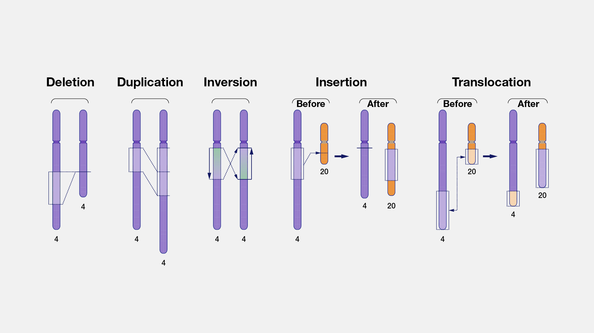

# Structural variants

Structural variants (SVs) represent genomic variations that involve breakage and rejoining of DNA segments. SVs can alter normal gene dosage, lead to rearrangements of genes and regulatory elements within a topologically associated domain, and potentially contribute to physical traits, genomic disorders, or complex traits.

<figure>

  <figcaption>
    <strong>Major categories of structural variation</strong>. 
  </figcaption>
</figure>

## Nomenclature

For most of the history of human genetics, it has been difficult to determine the precise boundaries and architecture of SVs because of technical limitations. In contrast to small variants that can be easily captured with HGVS nomenclature, SVs are often refered to using natural-language descriptions in the medical literature (e.g., "Deletion of exon 5"). This is changing with the increasingly important role of long-read genome sequencing (LRS) and new LRS technologies, but because so much of the literature has what we call "symbolic" SV notation, this is currently what phenoboard supports.